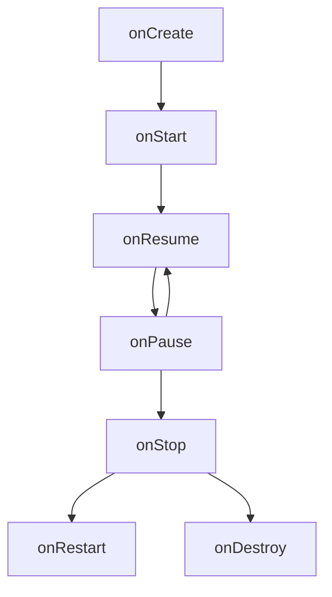
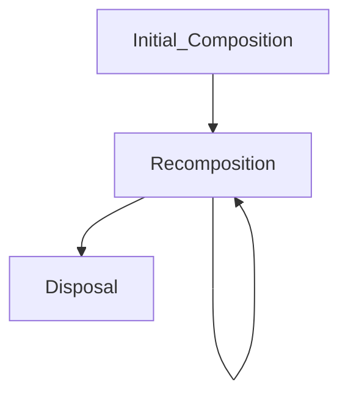

# 안드로이드 기본 구조

### Android Components

`Activity`, `Content Provider`,`BroadcastReceiver`, `Service`

#### Activity

**메인 액티비티** - 앱을 켰을 때 바로 보이는 홈 화면

> 액티비티는 웹페이지와 같이 화면을 채우는 UI창이지만, 필요에 따라 다른 창 위에 작게 띄울 수도 있다.

- “Kotlin 클래스 파일”과 “레이아웃 XML 파일”로 구성
  - XML 파일에서는 액티비티의 UI를 자유롭게 만들 수 있다.
    - View, Button, TextView와 같은 서브 클래스 제공

#### Content Provider

- 다른 애플리케이션 데이터에 접근이 필요할 때 사용하는 컴포넌트

일반적으로 각 앱은 하나의 프로세스로 실행되며 자신의 프로세스에서 사용하는 데이터는 자신만 접근가능하도록 되어 있습니다.

하지만 사진첩에 있는 사진들을 가져오거나 연락처에 있는 연락처 정보를 가져와야하는 경우가 있다

- ContentProvider는 데이터가 다른 앱에서 사용할 수 있도록 통로를 제공해줍니다.
- 앱의 보안을 위해 생겨난 안드로이드 기본 구성요소이기 때문에 안드로이드 시스템에서 관리하며 Manifest 파일에 명시해줘야 시스템에서 알 수 있다.

##### ContentProvider를 사용하는 경우

- 내 어플리케이션에서 다른 애플리케이션의 ContentProvider에 엑세스 하기 위해 코드 구현
- 내 애플레이케이션에 ContentProvider를 생성하여 다른 애플리케이션과 데이터 공유

<sub> 자세한 건 노션 참고

---

### Intent

- Intent는 안드로이드에서 컴포넌트 간 통신을 담당하는 메시시 객체
- 주로 액티비티간 화면 전환, 서비스 시작, 브로드캐스트 메시지 전달 등에 사용

| 유형          | 설명                                      | 예시                                                          |
| ------------- | ----------------------------------------- | ------------------------------------------------------------- |
| 명시적 Intent | 특정 컴포넌트로 이동                      | `Intent(this, SecondActivity::class.java)`                    |
| 암시적 Intent | 작업만 지정하고 실행할 앱은 시스템이 결정 | `Intent(Intent.ACTION_VIEW, Uri.parse("https://google.com"))` |
| 데이터 전달   | putExtra로 데이터 추가 & getExtra로 받기  | `intent.putExtra("key", value)`                               |
| 결과 반환     | ActivityResult API 사용                   | `registerForActivityResult(...)`                              |

---

### Android Lifecycle

#### Activity



#### Composable



---

### Project Structure

```plain
|- app
    |- manifests
        - AndroidManifest.xml ← (앱의 설정 파일)
    |- kotlin+java
        |- package(com.apptive.app...) ← (앱의 핵심 소스 코드 포함)
        |- package(androidTest) ← (UI 테스트 코드)
        |- package(test)  ← (단위 테스트,비즈니스 로직 테스트)
    |- res
        |- drawable ← (앱에서 사용할 이미지 파일 저장, PNG, SVG 등)
        |- mipmap ← (앱 아이콘 파일 저장, 런처 아이콘)
        |- values
            - colors.xml ← (앱에서 사용할 색상을 정의)
            - strings.xml ← (앱에서 사용할 문자열(텍스트) 저장)
            |- theme ← (앱의 테마 및 스타일 정의, 생략 가능)
|- Gradle Scripts
    - build.gradle(Project) ← (프로젝트 전체 설정, Gradle 플러그인 및 버전 관리)
    - build.gradle(Module) ← (앱 모듈 설정, 의존성 추가, SDK 버전 설정)
    - settings.gradle ← (프로젝트에 포함된 모듈 정의)
```

---

### Jetpack Compose

#### Layout

(Box, Column, Row, Spacer 등 **Jetpack Compose의 기본적인 레이아웃의 종류**에 대해 조사해주세요.)

- **Box** - 자식 요소를 겹쳐서 배치 가능한 컨테이너
- **Column** - 세로 방향(수직)으로 구성 요소를 배치하는 레이아웃
- **Row** - 가로 방향(수평)으로 구성 요소를 배치하는 레이아웃
- **Spacer** - 특정한 크기의 빈 공간을 만들 때 사용하는 레이아웃 요소

#### Entry Point

(아래는 Jetpack Compose 프로젝트르 생성했을 때 기본적으로 생성되는 코드입니다. 앱에서 가장 처음 실행되는 코드이기도 합니다. 각 문장이 무엇을 의미하는지 주석을 달아주세요.)

```kotlin
// MainActivity 클래스 정의 (Jetpack Compose 기반의 액티비티)
class MainActivity : ComponentActivity() {
    // onCreate() 메서드: 액티비티가 생성될 때 실행되는 함수
    override fun onCreate(savedInstanceState: Bundle?) {
        super.onCreate(savedInstanceState) // 부모 클래스의 onCreate() 실행 (기본 설정 수행)
        setContent { // Compose UI를 설정하는 블록 (Jetpack Compose에서 UI를 정의하는 역할)
            LayoutTheme { // LayoutTheme를 적용 (앱의 테마 설정)
                // Surface: 배경 색상을 가지는 컨테이너 역할을 함
                Surface(
                    modifier = Modifier.fillMaxSize(), // 화면 전체를 채우도록 설정
                    color = MaterialTheme.colorScheme.background // 테마에서 지정된 배경색 사용
                ) {
                    Greeting("Android") // Greeting() 함수 호출하여 "Hello Android!" 표시
                }
            }
        }
    }
}

// @Composable: 이 함수가 Compose UI를 생성하는 함수임을 나타냄
@Composable
fun Greeting(name: String, modifier: Modifier = Modifier) {
    Text(
        text = "Hello $name!", // 화면에 "Hello Android!" 등의 텍스트를 표시
        modifier = modifier // 사용자가 전달할 수 있는 Modifier (기본값으로 아무 설정 없음)
    )
}

// @Preview: 미리보기 기능을 제공하는 애너테이션
@Preview(showBackground = true) // 배경이 보이는 상태에서 UI 미리보기 가능
@Composable
fun GreetingPreview() {
    LayoutTheme { // 테마 적용
        Greeting("Android") // Greeting() 함수 실행하여 "Hello Android!" 출력
    }
}
```

---

## 의논해볼 것

- [ ] 화면을 회전시키면 Activity의 Lifecycle은 어떻게 변할까요?
- [ ] Jetpack Compose 이전에는 Composable 대신 View 객체로 UI를 사용했습니다. 어떤 점이 다를까요? (Lifecycle 등)
- [ ] build.gradle은 module 레벨, project 레벨로 나뉘어집니다. 둘은 어떤 차이일까요?

---
