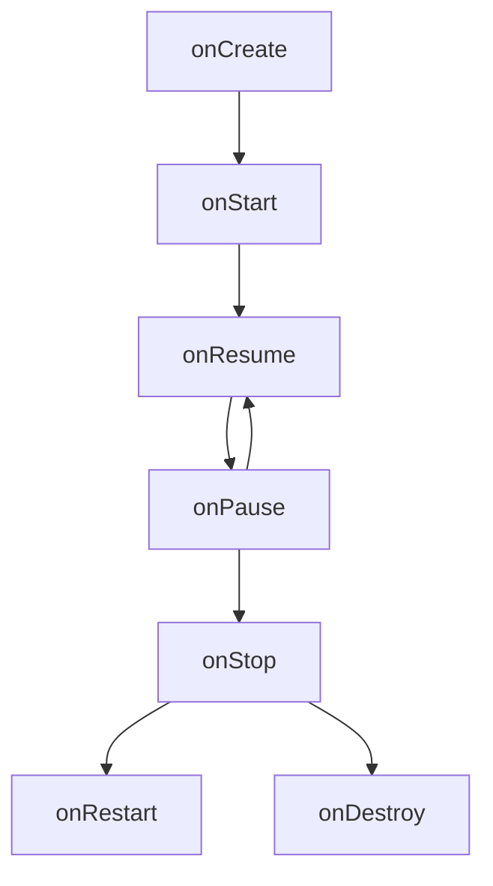

# 안드로이드 기본 구조

### Android Components

`Activity`, `Content Provider`,`BroadcastReceiver`, `Service`

#### Activity

**메인 액티비티** - 앱을 켰을 때 바로 보이는 홈 화면

> 액티비티는 웹페이지와 같이 화면을 채우는 UI창이지만, 필요에 따라 다른 창 위에 작게 띄울 수도 있다.

- “Kotlin 클래스 파일”과 “레이아웃 XML 파일”로 구성
  - XML 파일에서는 액티비티의 UI를 자유롭게 만들 수 있다.
    - View, Button, TextView와 같은 서브 클래스 제공

#### Content Provider

- 다른 애플리케이션 데이터에 접근이 필요할 때 사용하는 컴포넌트

일반적으로 각 앱은 하나의 프로세스로 실행되며 자신의 프로세스에서 사용하는 데이터는 자신만 접근가능하도록 되어 있습니다.

하지만 사진첩에 있는 사진들을 가져오거나 연락처에 있는 연락처 정보를 가져와야하는 경우가 있다

- ContentProvider는 데이터가 다른 앱에서 사용할 수 있도록 통로를 제공해줍니다.
- 앱의 보안을 위해 생겨난 안드로이드 기본 구성요소이기 때문에 안드로이드 시스템에서 관리하며 Manifest 파일에 명시해줘야 시스템에서 알 수 있다.

##### ContentProvider를 사용하는 경우

- 내 어플리케이션에서 다른 애플리케이션의 ContentProvider에 엑세스 하기 위해 코드 구현
- 내 애플레이케이션에 ContentProvider를 생성하여 다른 애플리케이션과 데이터 공유

<sub> 자세한 건 노션 참고

---

### Intent

- Intent는 안드로이드에서 컴포넌트 간 통신을 담당하는 메시시 객체
- 주로 액티비티간 화면 전환, 서비스 시작, 브로드캐스트 메시지 전달 등에 사용

| 유형          | 설명                                      | 예시                                                          |
| ------------- | ----------------------------------------- | ------------------------------------------------------------- |
| 명시적 Intent | 특정 컴포넌트로 이동                      | `Intent(this, SecondActivity::class.java)`                    |
| 암시적 Intent | 작업만 지정하고 실행할 앱은 시스템이 결정 | `Intent(Intent.ACTION_VIEW, Uri.parse("https://google.com"))` |
| 데이터 전달   | putExtra로 데이터 추가 & getExtra로 받기  | `intent.putExtra("key", value)`                               |
| 결과 반환     | ActivityResult API 사용                   | `registerForActivityResult(...)`                              |

### Android Lifecycle

#### Activity



#### Composable

(UI는 Composable 단위로 구성됩니다. Composable의 라이프사이클은 어떻게 될까요?)

### Project Structure

(Android Studio에서 프로젝트를 새로 시작하면 기본적인 폴더 구조가 설정됩니다.  
아래를 참고하여 각 폴더와 파일의 역할에 대해 이해하는 바를 적어주세요.)

```plain
|- app
    |- manifests
        - AndroidManifest.xml
    |- kotlin+java
        |- package(com.apptive.app...)
        |- package(androidTest)
        |- package(test)
    |- res
        |- drawable
        |- mipmap (생략해도 됨)
        |- values
            - colors.xml
            - strings.xml
            |- theme (생략해도 됨)
|- Gradle Scripts
    - build.gradle(Project)
    - build.gradle(Module)
    - settings.gradle
```

### Jetpack Compose

#### Layout

(Box, Column, Row, Spacer 등 **Jetpack Compose의 기본적인 레이아웃의 종류**에 대해 조사해주세요.)

#### Entry Point

(아래는 Jetpack Compose 프로젝트르 생성했을 때 기본적으로 생성되는 코드입니다. 앱에서 가장 처음 실행되는 코드이기도 합니다. 각 문장이 무엇을 의미하는지 주석을 달아주세요.)

```kotlin
class MainActivity : ComponentActivity() {
    override fun onCreate(savedInstanceState: Bundle?) {
        super.onCreate(savedInstanceState)
        setContent {
            LayoutTheme {
                // A surface container using the 'background' color from the theme
                Surface(
                    modifier = Modifier.fillMaxSize(),
                    color = MaterialTheme.colorScheme.background
                ) {
                    Greeting("Android")
                }
            }
        }
    }
}

@Composable
fun Greeting(name: String, modifier: Modifier = Modifier) {
    Text(
        text = "Hello $name!",
        modifier = modifier
    )
}

@Preview(showBackground = true)
@Composable
fun GreetingPreview() {
    LayoutTheme {
        Greeting("Android")
    }
}
```

## 할일

- 안드로이드 스튜디오 에뮬레이터 설정
- 안드로이드 스튜디오 SDK 설치 (28~)
- 안드로이드 스튜디오 USB/Wifi 디버깅 (IOS 모바일 디바이스 제외.)

## 의논해볼 것

- [ ] 화면을 회전시키면 Activity의 Lifecycle은 어떻게 변할까요?
- [ ] Jetpack Compose 이전에는 Composable 대신 View 객체로 UI를 사용했습니다. 어떤 점이 다를까요? (Lifecycle 등)
- [ ] build.gradle은 module 레벨, project 레벨로 나뉘어집니다. 둘은 어떤 차이일까요?

---

## 궁금한 점

- 반드시 1개 이상 작성합니다.

## 참고자료

- 출처는 중요합니다. 되도록 작성해주세요.

## 비고

25.03.24 KimGiyun 수정.
