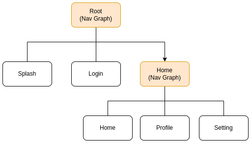

# Retrofit
 로컬과 인터넷에서 데이터를 불러오고 수십개의 데이터를 화면에 띄울 수 있도록 스크롤 기능을 제공해봅니다.

## 📐 진행방식
- 현재 브랜치에서 `<자신의 기수>` 안드로이드 프로젝트 폴더를 엽니다.
  - 만약 `<자신의 기수>` 폴더가 없다면 안드로이드 스튜디오로 새로 만듭니다.
  - 새로 만드는 프로젝트의 패키지명은 `com.apptive.retrofit`로 합니다.
- 각자의 패키지를 정의하여 그곳에서 별도로 진행합니다. 
  - 과제 진행을 위한 초기 코드는 `com.apptive.retrofit.template` 패키지에 있습니다. 
  - 이곳의 파일을 자신의 패키지에 복사한 후 과제를 진행합니다.
  ```plain
  |- (패키지)
    |- (자신의 이름)
      - (template)의 파일 복사
    |- template    # 수정 금지
      - 초기 코드
      - ...
  ```
  - ex) `com.apptive.layout.junyoung.presentation`, `com.apptive.layout.jinseo.presentation`
- 자신의 패키지에서 과제를 구현하면서 수시로 commit, push합니다.

## 📑 문제


## 🌀 환경 요구사항
- Jetpack Compose(activityCompose)는 1.9.0v 이상을 이용합니다.
- Kotlin은 1.9.0v 이상을 이용합니다.
- Android Studio Iguana 이상의 환경에서 코드를 작성합니다.
- 다음의 종속성을 새로 추가합니다.
  - `com.squareup.retrofit2:retrofit` (버전 2.11.0 이상)
    - **retrofit**: Kotlin HTTP 통신 라이브러리
    - [retrofit 공식 홈페이지](https://square.github.io/retrofit/)
  - `com.squareup.retrofit2:converter-gson` (버전 2.11.0 이상)
    - **Gson**: data class <-> JSON string 변환 라이브러리
    - [Gson 공식 홈페이지](https://github.com/google/gson)
- 온라인에서 이미지 정보를 불러오는 데에 [Lorem Picsum API](https://picsum.photos/)를 이용합니다.
  - 호출 API: https://picsum.photos/v2/list
- `AndroidManifests.xml`에 인터넷 접근을 허용하도록 권한을 추가합니다.
- retrofit 관련 클래스, 파일은 `network` 패키지에 작성합니다.

## 🧸 기능 요구사항
- Lorem Picsum API 호출 결과를 담을 DTO인 `LoremPicsumImage` 데이터 클래스를 정의합니다.
  - LoremPicsum API의 JSON의 형식을 참고합니다.
  - 데이터 클래스의 각 멤버에는 적절한 `@SerializedName` 어노테이션을 붙입니다.
- API 엔드포인트를 담을 `LoremPicsumService`를 정의합니다.
  - 코루틴을 알고 있다면 => `suspend fun getImageList(): Response<...>`
  - 코루틴을 모른다면 => `fun getImageList(): Call<...>`
- API 호출을 수행할 `RetrofitClient`를 정의합니다.
  - 싱글톤으로 정의합니다. (`object`)
  - 멤버로 `loremPicsum: LoremPicsumService`를 갖습니다.
  - `RetrofitClient.loremPicsum.getImageList()`와 같이 API를 호출합니다.
- 이미지 정보를 화면에 표시할 컴포저블을 정의합니다. (`ImageInfoCard`)
  - `model` 패키지를 정의하여 이곳에 컴포저블을 작성합니다. (optional)
  - 매개변수로 `Modifier`, `LoremPicsumImage`를 포함합니다.
  - 검정색의 테두리를 갖습니다.
  - 모서리가 둥근 직사각형 모양을 갖습니다.
- 화면에 두 열을 만들어 `ImageInfoCard`를 나열합니다.
  - 두 열 모두 스크롤이 가능해야 합니다. (`LazyColumn`)
- 
## 🔥 더 해보기
- API 주소에 변수를 받을 수 있도록 개선해보세요.
  - https://picsum.photos/v2/list?page=2&limit=100에서 `page`, `limit` 부분 
- API 호출의 반환형을 Response로 수정해보세요. 
- Gson이 아닌, 다른 JSON Converter를 사용해보세요. 
- 두 열이 따로 스크롤되는 것이 아닌, 다함께 스크롤 되도록 개선해보세요. (`LazyVerticalGrid`)
- 컴포저블이 non-UI 로직을 갖지 않도록 ViewModel을 정의하도록 리팩토링 해보세요. (`MVVM`)
- 이미지 정보가 아닌, 이미지를 표시하도록 개선해보세요. (`Coil`)
- `HomeNavGraph`를 따로 정의하고, 하단 버튼으로 화면을 이동해보세요. (`Nested Navigation`)  
  

## 궁금점과 질문
