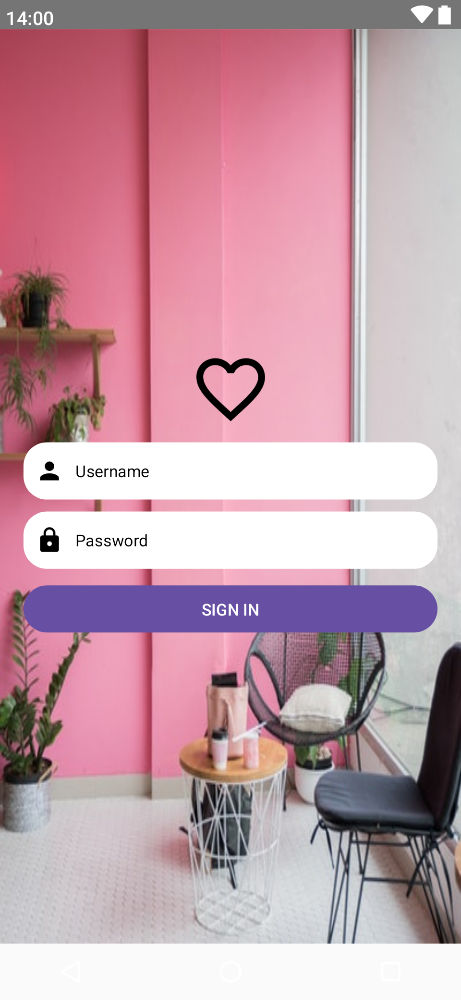

# Jetpack Compose Basic Layouts
Jetpack Compose의 기본 레이아웃인 `Box, Row, Column`를 활용하여 화면을 구성하고, `Modifier`로 다양한 속성을 조정해봅시다.

## 📐 진행방식
- 현재 브랜치로부터 `android-compose/<본인 이름>` 브랜치를 생성하고 이동합니다.
- `template` 폴더를 복사하고 `<자신의 영문명>`으로 변경합니다.
- Android Studio로 `<자신의 영문명>`을 열어 과제를 진행합니다.
- 과제를 구현한 후 `android-compose/main` 브랜치로 Pull Request를 올립니다.

## 📑 문제
  

Jetpack Compose를 활용하여 위 화면을 구현해주세요. 버튼 클릭 시 동작 등은 고려하지 않아도 됩니다.

## 🌀 환경 요구사항
- Jetpack Compose(`activityCompose`)는 1.9.0v 이상을 이용합니다.
- Kotlin은 1.9.0v 이상을 이용합니다.\
- Android Studio **Iguana** 이상의 환경에서 코드를 작성합니다.
- `presentation/Login.kt`에 @Preview 함수를 정의하여 화면 미리보기를 보면서 코드를 작성합니다.
- Android Studio(+Terminal)를 통해 Git을 이용해보세요! Git Bash나 GUI가 필요없습니다. 

## 🧸 기능 요구사항
- 화면 요소는 모두 중앙정렬을 기본으로 합니다. 화면 비율이나 크기가 달라져도 화면 요소는 중앙에 위치해야 합니다.
- Login 화면에 대한 진입점 함수는 `LoginScreen()`입니다. 
- 화면의 각 요소는 @Composable 함수로 분리, 구분되어 있어야 합니다.
- 이름, 비밀번호 입력창은 동일한 @Composable 함수를 사용합니다.
- 아이콘은 [Material Icons](https://fonts.google.com/icons)를 사용합니다. 코드에서 `Icons.Default.Person`과 같은 방식으로 불러올 수 있습니다. 

## 🔥 더 해보기
다음 중 하나 이상을 골라 도전해보세요!

- 배경화면을 이미지가 아닌, 영상으로 변경하기
- 배경화면의 이미지를 온라인으로부터 불러오기
- `LoginScreen()` 함수에 Box, Column, Row 등을 직접 쓰지 않고, 아래처럼 `LoginBackground(...)` 함수를 정의해서 받도록 리팩토링하기
```kotlin
@Composable
fun LoginScreen() {
  LoginBackground {
    ...
  }
}

@Composable
private fun LoginBackground(
  content: @Composable ...
) {
  ...
}
```

## 궁금점과 질문
(코드를 작성하면서 자유롭게 적어주세요)

## 메모


